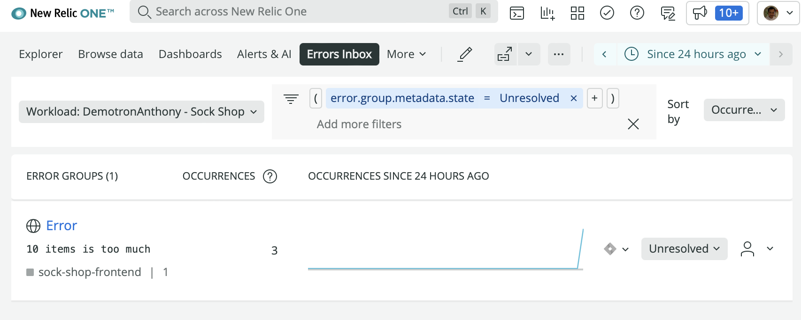
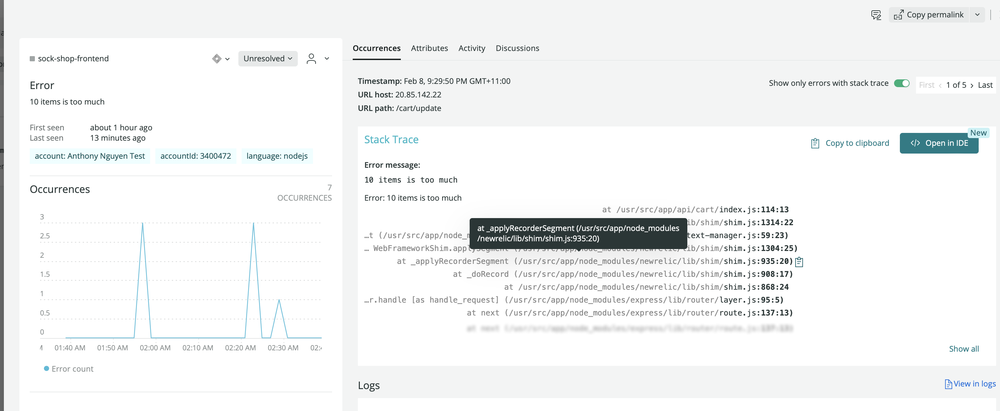
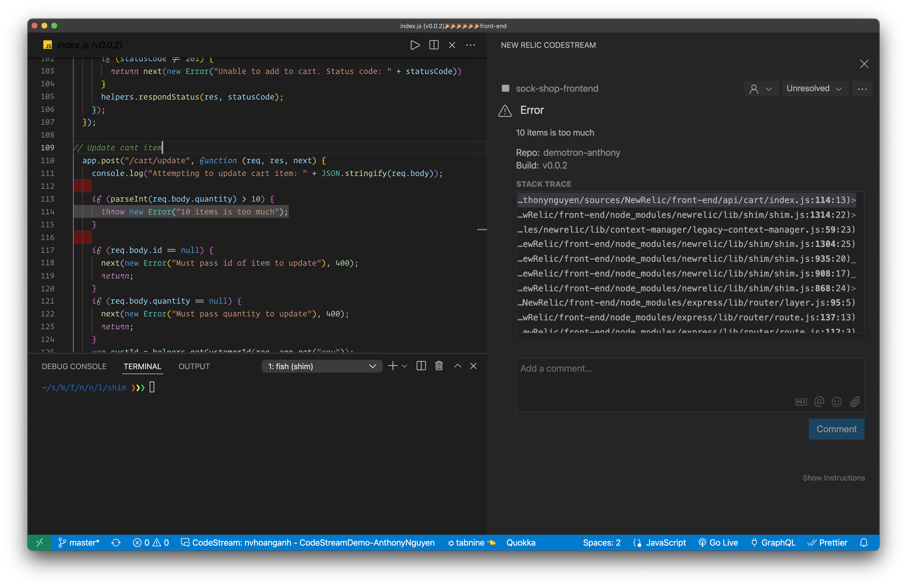
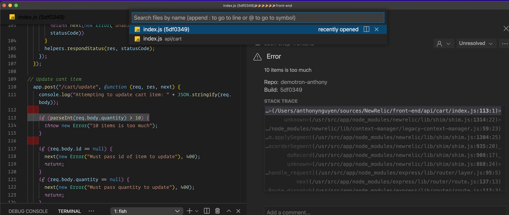

# Create your own New Relic Demo environment on Kubernetes cluster

-   This tutorial will walk you through the process on how you can fully observe a complex, multi-language microservice based E-Commerce application running in a Kubernetes cluster using [https://pixielabs.ai](https://pixielabs.ai) and New Relic
-   this walkthought will cover the following features of New Relic One Platform:
    -   Create new Kubernetes cluster using either Azure AKS or AWS EKS
    -   Deploy a full blown E-Commerce kubernetes application to your cluster
    -   Start observing your kubernetes application with Pixie without instrumentation
    -   Enable Distributed Tracing with New Relic APM
    -   Monitor Real User Experience using Browser Monitoring
    -   Pull custom K8s metrics into New Relic Database using Pixie Script and New Relic Flex
    -   View application Errors in New Relic Errors Inbox
    -   Jump straight to the error line in VSCode using New Relic CodeStream Integration

## Prerequisites

-   Azure or AWS Cloud account
-   A new New Relic account [sign up here](https://newrelic.com/signup)
-   Docker desktop installed [link] (https://docs.docker.com/get-docker/)
-   Docker Hub account [sign up here](https://hub.docker.com/signup)
-   Github account [sign up here](https://github.com/join)
-   Kubectl, helm3, nodejs, git, Azure or AWS cli installed
-   K6 load test tool [link](https://k6.io/docs/getting-started/installation/)
-   VScode [link](https://code.visualstudio.com/download)
-   Basic Bash knowledge (all commands are Bash commands)

## Create your new Kubernetes cluster

### Create Azure AKS cluster

```bash
# install azure cli at https://docs.microsoft.com/en-us/cli/azure/install-azure-cli
# login
az login

# if you have multiple subscriptions, select the right subscription
az account set -s SUBSCRIPTION_ID

# create resource group
az group create --name pixiedemo --location eastus

# create the K8s Cluster with 2 nodes (do not enable monitoring). We need 2 in order to see 2 nodes in New Relic
az aks create --resource-group pixiedemo --name pixiecluster --node-count 2 --enable-addons http_application_routing --generate-ssh-keys --enable-rbac

# connect to the cluster via kubectl
az aks install-cli
az aks get-credentials --resource-group pixiedemo --name pixiecluster

# confirm can connect to the cluster
kubectl get nodes -o wide
```

### Create EKS Cluster in AWS

```bash
# install aws cli at https://docs.aws.amazon.com/cli/latest/userguide/getting-started-install.html
# login
aws configure

# install eksctl https://docs.aws.amazon.com/eks/latest/userguide/eksctl.html
# create new Managed nodes cluster (not the Fargate), this will create 2 nodes cluster (m5.larger)
eksctl create cluster --name pixiecluster --region us-east-1

# install kubectl cli tool to your computer https://kubernetes.io/docs/tasks/tools/
# download correct kubeconfig
eksctl utils write-kubeconfig --cluster=pixiecluster

# confirm can connect to the cluster
kubectl get nodes -o wide
```

## Setup a simple 2 Tier application (UI + Redis) on new AKS Cluster

-   First, let's deploy a very simple application and monitor it using New Relic and Pixie

```bash
# create simple Voting application
kubectl create namespace simplevote

kubectl apply -f apps/simple-vote.yaml --namespace=simplevote

# check external IP for the front end app and wait until the external-ip is on
kubectl get service simple-vote-front --watch --namespace=simplevote

# test to make sure you can access the html, you can also open this URL on browser
CURL http://<EXTERNAL-IP>

# install helm3 at https://helm.sh/docs/intro/install/
# login to newrelic one and follow guided install to add new k8s integration using heml3 command
# install using helm3
kubectl apply -f https://download.newrelic.com/install/kubernetes/pixie/latest/px.dev_viziers.yaml && \
kubectl apply -f https://download.newrelic.com/install/kubernetes/pixie/latest/olm_crd.yaml && \
helm repo add newrelic https://helm-charts.newrelic.com && helm repo update && \
kubectl create namespace newrelic ; helm upgrade --install newrelic-bundle newrelic/nri-bundle \
 --set global.licenseKey=LICENSE_KEY \
 --set global.cluster=pixiedemo \
 --namespace=newrelic \
 --set newrelic-infrastructure.privileged=true \
 --set global.lowDataMode=true \
 --set ksm.enabled=true \
 --set kubeEvents.enabled=true \
 --set prometheus.enabled=true \
 --set logging.enabled=true \
 --set newrelic-pixie.enabled=true \
 --set newrelic-pixie.apiKey=PIXIE_API_KEY \
 --set pixie-chart.enabled=true \
 --set pixie-chart.deployKey=PIXIE_DEPLOY_KEY \
 --set pixie-chart.clusterName=pixiedemo

# install k6 load test from https://k6.io and run quick load test (replace EXTERNAL-IP with the correct external IP you get above)
k6 run -e PUBLIC_IP=<EXTERNAL-IP> loadtests/azure-vote.js

# go to NR1, select Kubernetes and click on Live debugging with Pixie and select "px/http_request_stats"
# you will see traffic going into the cluster
```

## Part 2. Run pixie CLI locally

```bash
# install pixie-cli
bash install-pixie-no-auth.sh

# login to NewRelic One UI, select Kubernetes, click on the cluster and select Live debugging with Pixie and click "Copy command"
# run this command
px auth login --api_key='YOUR_API_KEY'

# show the list of out the box script you can run
px scripts list

# run one of the script
# open http://<EXTERNAL-IP> and click on Dogs or Cats then run this command
px run px/redis_data


```

## Part 3. Setup E-Commerce Microservice application to AKS

-   next, let's deploy our e-commerce microservice application [link](https://github.com/microservices-demo/microservices-demo/blob/master/internal-docs/design.md)

```bash
# deploy https://github.com/microservices-demo/microservices-demo/blob/master/internal-docs/design.md
# update the type for front-end servvice to LoadBalancer from NodePort
kubectl create namespace sock-shop

kubectl apply -f apps/sock-shop.yaml --namespace=sock-shop

# get the external IP of the front-end service
kubectl get service --watch --namespace=sock-shop

# make sure all containers are running properly
kubectl get pod --namespace=sock-shop

# make sure the frontend is now accessible
curl http://<EXTERNAL-IP>

# open http://<EXTERNAL-IP> and play around with the app (sign up for user, add to cart, checkout, etc..)

# run load test against this new Website
k6 run  -e PUBLIC_IP=<EXTERNAL-IP> loadtests/sock-shop.js

# go to NR1, select Kubernetes and click on Live debugging with Pixie and select "px/http_request_stats"
# you will see traffic going into the cluster

# run a custom Pixie script to see the MongoDB connections
px run -f get_connections_to_mongodb.py

# run local pixie script - output in json or csv format
px run -f get_connections_to_mongodb.py -o json
```

## Part 4. Add APM to a NodeJs Service and enable distributed tracing

-   right now, we don't really have distributed tracing for the sock-shop application. This is because Pixie can only inspect http traffic but cannot modify them. For Distributed tracing to work, we will need to inject custom `traceid` header to all HTTP traffic.
-   right now under `Services - APM` you wouldn't see any entries belong to the sock-shop
-   in this step, we will add New Relic APM agent to couple of our services and turn on distributed tracing

```bash
# signup for a docker.com account
# fork and clone https://github.com/microservices-demo/front-end and build your own docker image
mkdir apps/sock-shop
cd apps/sock-shop
git clone https://github.com/<YOUR_GITHUB_USER>/front-end.git
cd front-end

# modify Dockerfile and change from 'FROM node:12-alpine' to 'FROM node:12-alpine'

docker build . -t <YOUR-DOCKER-ACCOUNT>/sock-shop-frontend:same


# if you're on M1 macbook (like me), then you will need to build amd64
# docker buildx build --platform linux/amd64 . -t <YOUR-DOCKER-ACCOUNT>/sock-shop-frontend:same --progress=plain
docker push <YOUR-DOCKER-ACCOUNT>/sock-shop-frontend:same

# update line 19 of /apps/sock-shop-frontend-own-image.yaml and replace nvhoanganh1909 with your docker account name
cd ../..

# apply the change
kubectl apply -f sock-shop-frontend-own-image.yaml --namespace=sock-shop

# make sure URL still working
curl http://<EXTERNAL-IP>

# install NR nodejs agent
cd sock-shop/front-end
npm install newrelic --save

# Edit Dockerfile and add ENV NEW_RELIC_NO_CONFIG_FILE=true
docker build . -t <YOUR-DOCKER-ACCOUNT>/sock-shop-frontend:apm

# push the image again
docker push <YOUR-DOCKER-ACCOUNT>/sock-shop-frontend:apm

# IMPORTANT: update sock-shop-frontend-own-image-with-apm.yaml file, line 33 with your NR API key
cd ../..
kubectl apply -f sock-shop-frontend-own-image-with-apm.yaml --namespace=sock-shop

# run load test again and come back to Services - APM, you should see one new entry there
k6 run  -e PUBLIC_IP=<EXTERNAL-IP> loadtests/sock-shop.js
```

## Part 5. Add Browser monitoring

-   now that we have APM agent installed for our backend services, let's monitor Real User experience by enabling Browser Integration

```bash
# go to NR1, select Add more data and select Browser and select 'Copy/Paste Javascript code'
# select the app from previous step
# edit apps/sock-shop/front-end/public/js/front.js file and paste the content of the <script type="text/javascript"> tag in it (NOT including <script type="text/javascript"> itself)

# build new version again
cd sock-shop/front-end
docker build . -t <YOUR-DOCKER-ACCOUNT>/sock-shop-frontend:rum

# push the image again
docker push <YOUR-DOCKER-ACCOUNT>/sock-shop-frontend:rum

# apply change
cd ../..
kubectl apply -f sock-shop-frontend-own-image-with-rum.yaml --namespace=sock-shop

# manually navigate to the app via browser, click through some pages
# go back to NR1, click on Browsers app, you should see new app in the list
```

## Part 6. Install New Relic Infrastructure Agent + Flex on K8s and push Pixie data to NRDB

-   you can use New Relic Infrastructure Agent and Pixie CLI to periodically push metrics from Pixie to NRDB

```bash
# build and push new New Relic Infrastructure agent image with Pixie cli installed

docker build . -t <YOUR-DOCKER-ACCOUNT>/newrelic_infrastructure_with_pixie:latest

docker push <YOUR-DOCKER-ACCOUNT>/newrelic_infrastructure_with_pixie:latest

# create file containging New Relic ingest API key
echo -n 'YOUR_NR_API_KEY' > nringestapi

# create file containging PIXIE API key
# you can get this by click on `Copy command` link under `Live debugging with Pixie` tab on New Relic Kubernetes Cluster Explorer page
echo -n 'YOUR_PIXIE_API_KEY' > pixieapikey

# assuming your kubectl config file is at default location: $HOME/.kube/config
kubectl create secret generic pixiesecrets --from-file=./pixiesecrets/pixieapikey --from-file=$HOME/.kube/config --from-file=./pixiesecrets/nringestapi

# deploy the file
kubectl apply -f nri-flex.yml
```

-   after couple minutes, you can query the data in New Relic like this


## Part 7. Introduce some error code and see them in New Relic

-   right now the app is working perfectly, so there is no error
-   to introduce some error, let's modify `apps/front-end/api/cart/index.js` file and add the following

```javascript
app.post("/cart/update", function (req, res, next) {
    console.log("Attempting to update cart item: " + JSON.stringify(req.body));

    // throw an error when quantity is greater than 10
    if (parseInt(req.body.quantity) > 10) {
      throw new Error("10 items is too much");
    }

    // rest of the file..
```

-   report unhanled errors to New Relic by modifying `app/front-end/helpers/index.js` file

```javascript
helpers.errorHandler = function (err, req, res, next) {
	var ret = {
		message: err.message,
		error: err,
	};
	newrelic.noticeError(err);
	res.status(err.status || 500).send(ret);
};
```

-   build and deploy the new image

```bash

docker build . -t <YOUR-DOCKER-ACCOUNT>/sock-shop-frontend:error

# push image
docker push <YOUR-DOCKER-ACCOUNT>/sock-shop-frontend:error

# update line 19 of /apps/sock-shop-frontend-own-image-with-error.yaml and replace nvhoanganh1909 with your docker account name
# apply the change
kubectl apply -f sock-shop-frontend-own-image-with-error.yaml --namespace=sock-shop

# go to the app on browser, add an item into the cart and then update the cart
# setting the quantity to 10 => works fine
# setting the quantity to 11 => get 500 server (network tab in browser)
# go to NR, select 'sock-shop-frontend' under APM, you should see some error reported under Events > Errors
```

-   click on error will show stack trace
    

## Part 8. Add workload and view Errors inbox

-   go to NR1, select Workloads, then create new Workload
-   select 'sock-shop-frontend' app from APM
-   go to Errors Inbox, select your new workload from the workload dropdown
-   you will see error in your Error inbox



## Part 9. Install CodeStream to VSCode and view Errors inside the IDE

-   Install Vscode CodeStream extension and Sign up for an account
-   Create tag v0.0.2 and apply the changes by running the following command

```bash
# create and push new tag in front-end
cd apps/sock-shop/front-end
git tag -a v0.0.2 -m "tag version v0.0.2"
git push --tags

# get the current commit SHA by running this command
git log -1 --format="%H"
```

-   add 3 more env variables: `NEW_RELIC_METADATA_REPOSITORY_URL` and `NEW_RELIC_METADATA_RELEASE_TAG` and `NEW_RELIC_METADATA_COMMIT` in the yml file

```yaml
# ....
env:
    - name: SESSION_REDIS
      value: 'true'
    - name: NEW_RELIC_LICENSE_KEY
      value: 'YOUR_NR_KEY'
    - name: NEW_RELIC_METADATA_REPOSITORY_URL
      value: 'https://github.com/YOUR_GITHUB/front-end.git'
    - name: NEW_RELIC_METADATA_RELEASE_TAG
      value: 'v0.0.2'
    - name: NEW_RELIC_METADATA_COMMIT
      value: 'SHA_FROM_ABOVE'
    - name: NEW_RELIC_APP_NAME
      value: 'sock-shop-frontend'
# ....
```

-   deploy the new yaml changes

```bash
# apply k8s changes
kubectl apply -f sock-shop-frontend-own-image-with-error-codestream.yaml --namespace=sock-shop

# go back to the sock shop and reproduce the error again (update cart to 11 items)
# go back to Errors Inbox, click on the latest error
# click on 'Open in IDE', you should see VScode open at the right location, in read-only mode
```





-   Note: even when the code is changed, because we have the git SHA, Code Stream will still be able to show you the line of code from the stack trace
-   let's demonstrate this by removing the lines of code we added earlier, like this


-   Click on `Open In IDE` again, you will see that VScode is displaying the line of code



# Clean up your Resources

```bash
# delete the Azure AKS cluster
az aks delete --name pixiecluster --resource-group pixiedemo

# delete the AWS EKS cluster
eksctl delete cluster --name pixiecluster --region us-east-1
```
